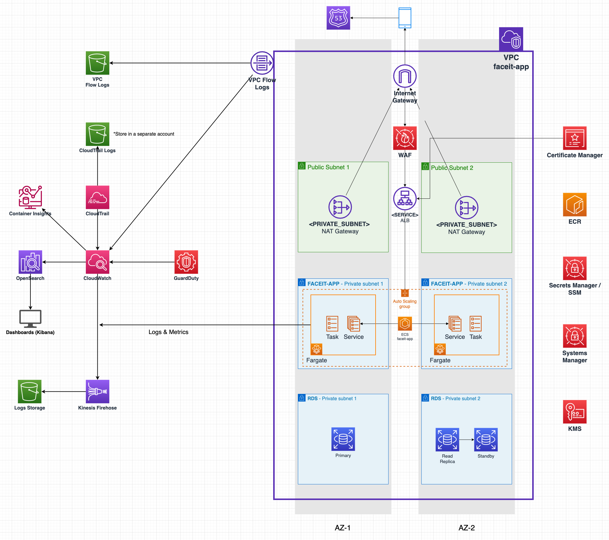
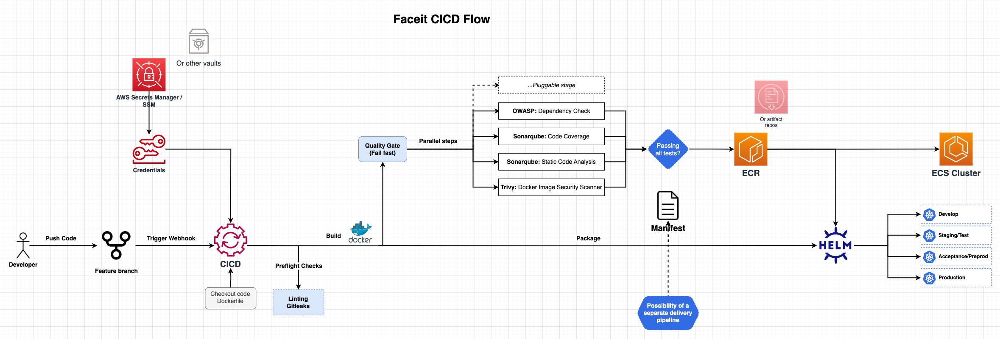

## Mert Alnuaimi - Solution

The repository is converted into a scalable, zone-redundant, and fault-tolerant Terraform deployment, leveraging AWS's 3-tier, multi-AZ architecture with autoscaling and metrics monitoring. Access the live application on AWS at: <br>https://go.app.faceit.challenge-task.link/health.

### FACEIT Infra Diagram


### FACEIT CICD Diagram


Notes:
- The solution dockerizes the Go application and pushes it to ECR.
- The application is deployed to an ECS cluster in 2 AZs.
- The application is fronted with an ALB for load balancing.
- The application receives the RDS Postgres credentials as environment variables in the container runtime.
- The RDS Postgres credentials are generated by Terraform and stored in SSM.
- The solution does not include the OpenSearch part mentioned in the diagram as it wasn't eligible for my AWS Free Tier.
- The solution uses modified [CloudPosse](https://github.com/cloudposse) Terraform modules with root module customizations.
- The Terraform modules allows enabling/disabling modules on demand depending on environment or service needs without code duplication or separate environment directories. It removes the requirement for Terragrunt. The modules can also be modified to incorporate into Terragrunt way of handling environments and multi-region.

### Example Successful response:
```html
 devops-challenge  develop !2  curl -v https://go.app.faceit.challenge-task.link/health                                                                         ✔  49s  app 

*   Trying 52.30.254.67:443...
* Connected to go.app.faceit.challenge-task.link (52.30.254.67) port 443 (#0)
* ALPN, offering h2
* ALPN, offering http/1.1
* successfully set certificate verify locations:
*  CAfile: /etc/ssl/cert.pem
*  CApath: none
* (304) (OUT), TLS handshake, Client hello (1):
* (304) (IN), TLS handshake, Server hello (2):
* TLSv1.2 (IN), TLS handshake, Certificate (11):
* TLSv1.2 (IN), TLS handshake, Server key exchange (12):
* TLSv1.2 (IN), TLS handshake, Server finished (14):
* TLSv1.2 (OUT), TLS handshake, Client key exchange (16):
* TLSv1.2 (OUT), TLS change cipher, Change cipher spec (1):
* TLSv1.2 (OUT), TLS handshake, Finished (20):
* TLSv1.2 (IN), TLS change cipher, Change cipher spec (1):
* TLSv1.2 (IN), TLS handshake, Finished (20):
* SSL connection using TLSv1.2 / ECDHE-RSA-AES128-GCM-SHA256
* ALPN, server accepted to use h2
* Server certificate:
*  subject: CN=go.app.faceit.challenge-task.link
*  start date: May 17 00:00:00 2023 GMT
*  expire date: Jun 14 23:59:59 2024 GMT
*  subjectAltName: host "go.app.faceit.challenge-task.link" matched cert's "go.app.faceit.challenge-task.link"
*  issuer: C=US; O=Amazon; CN=Amazon RSA 2048 M02
*  SSL certificate verify ok.
* Using HTTP2, server supports multiplexing
* Connection state changed (HTTP/2 confirmed)
* Copying HTTP/2 data in stream buffer to connection buffer after upgrade: len=0
* Using Stream ID: 1 (easy handle 0x7f9f2f00e200)
> GET /health HTTP/2
> Host: go.app.faceit.challenge-task.link
> user-agent: curl/7.79.1
> accept: */*
>
* Connection state changed (MAX_CONCURRENT_STREAMS == 128)!
< HTTP/2 200
< date: Fri, 19 May 2023 14:13:20 GMT
< content-type: text/plain; charset=utf-8
< content-length: 3
< set-cookie: AWSALB=oo3HvW09ZnsVxpLjqjJSyk7YE1qq007MCq+FlGOkNQ4sKCWjdl13Zii63E7RpKSVJ5VgAC/gSUD89Fgkiqnf0XgmxWyvhhg4N7ZPrMI4OrPCOXToDJoz4TpsEgRe; Expires=Fri, 26 May 2023 14:13:20 GMT; Path=/
< set-cookie: AWSALBCORS=oo3HvW09ZnsVxpLjqjJSyk7YE1qq007MCq+FlGOkNQ4sKCWjdl13Zii63E7RpKSVJ5VgAC/gSUD89Fgkiqnf0XgmxWyvhhg4N7ZPrMI4OrPCOXToDJoz4TpsEgRe; Expires=Fri, 26 May 2023 14:13:20 GMT; Path=/; SameSite=None; Secure
<
UP
* Connection #0 to host go.app.faceit.challenge-task.link left intact
```

---


# FACEIT DevOps Challenge

You have been asked to create the infrastructure for running a web application on a cloud platform of your preference (Google Cloud Platform preferred, AWS or Azure are also fine).

The [web application](test-app/README.md) can be found in the `test-app/` directory. Its only requirements are to be able to connect to a PostgreSQL database and perform PING requests.    

The goal of the challenge is to demonstrate hosting, managing, documenting and scaling a production-ready system.

This is not about website content or UI.

## Requirements

- Deliver the tooling to set up the application using Terraform on the cloud platform of your choice (free tiers are fine)
- Provide basic architecture diagrams and documentation on how to initialise the infrastructure along with any other documentation you think is appropriate
- Provide and document a mechanism for scaling the service and delivering the application to a larger audience
- Describe a possible solution for CI and/or CI/CD in order to release a new version of the application to production without any downtime

Be prepared to explain your choices

## Extra Mile Bonus (not a requirement)

In addition to the above, time permitting, consider the following suggestions for taking your implementation a step further:

- Monitoring/Alerting
- Implement CI/CD (github actions, travis, circleci, ...)
- Security

## General guidance

- We recommend using this repository as a starting point, you can clone it and add your code/docs to that repository
- Please do no open pull request with your challenge against **this repository**
- Submission of the challenge can be done either via your own public repository or zip file containing `.git` folder

